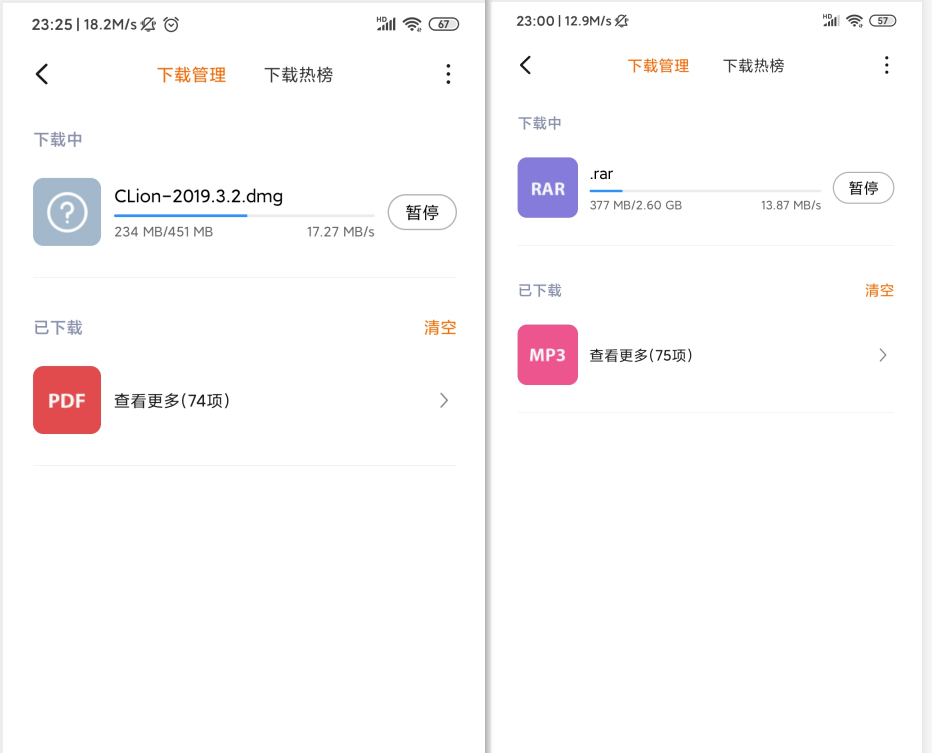
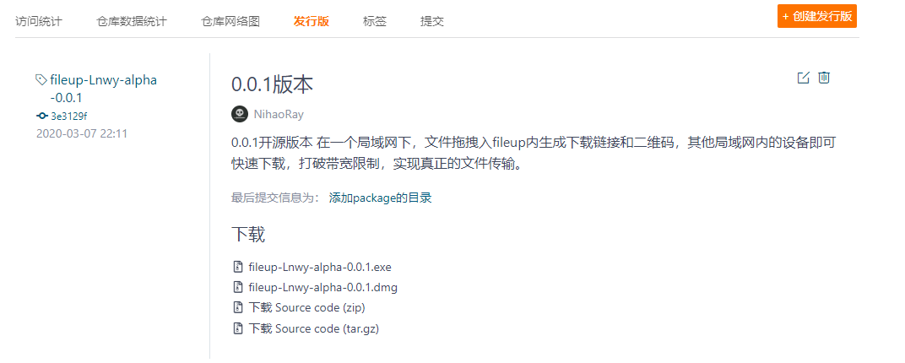
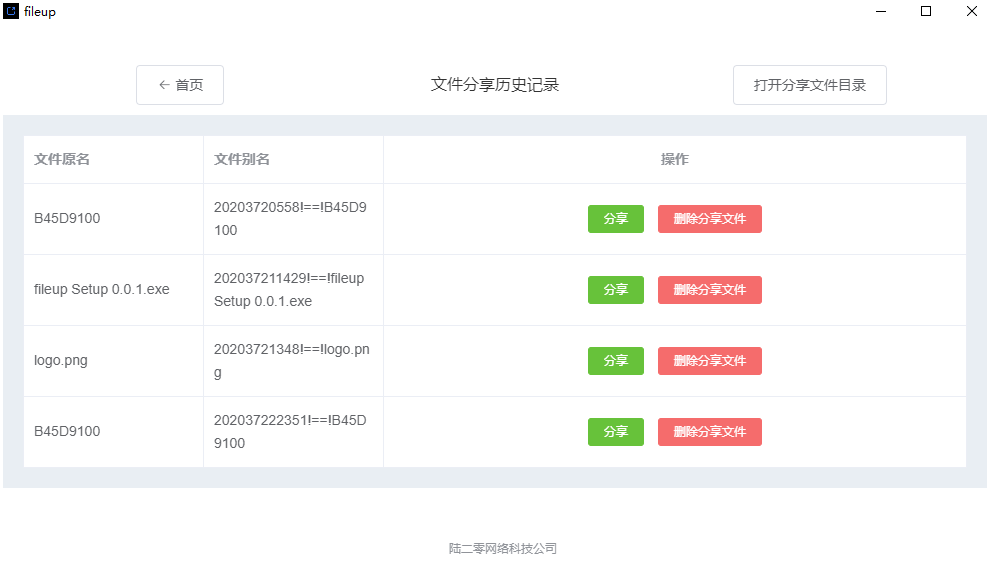
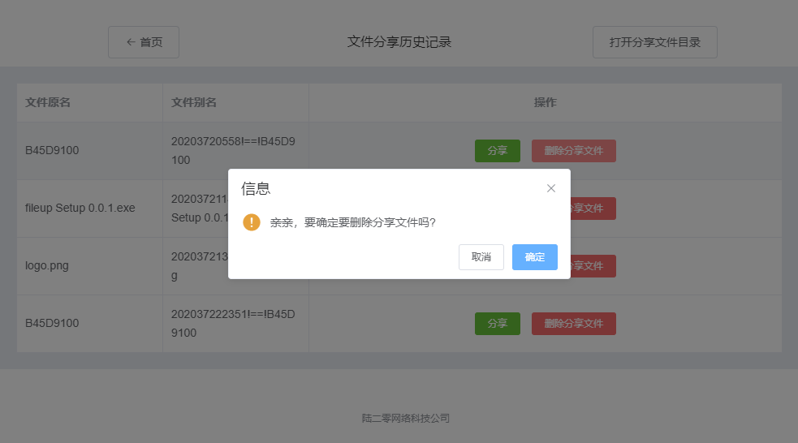

# fileup 局域网文件分享

## 经历过领导需要500M以上的大文件吗？领导开会紧急要用，然后文件传输要N小时! OMG！你要被炒鱿鱼啦！ 

> 下载速度，带宽直接打满，下载速度完全取决于你的路由器和电脑有多强，下载速度就有多快！

> 安全隐私，很多公司软件使用还要把你文件上传他们服务器，简直流氓！fileup文件直接放在本地。而且开源，源码开放随便看！

> VIP，超超级VIP各种限制，简直要命！ fileup这些都不需要，直接免费无限次使用，包括商业使用！

> 软件广告，在fileup这里绝对说NO！

> 跨平台，支持Windows，MacOS，Linux

> 我们就是老实的程序员，开放自家的产品免费给任何人使用！真正的世界命运共同体！

**以上的内容还不够，那么可以issue我们或者直接pull request帮助我们改进！**

## 如果没有fileup，内同事之间传输大文件简直噩梦，fileup的诞生就是终结这个噩梦！

#### 介绍
fileup项目来自于 **陆二零网络科技公司** 公司内部产品开放给大家，fileup是在局域网分享的软件。在一个局域网下，文件拖拽入fileup内生成下载链接和二维码，其他局域网内的设备即可快速下载，打破带宽限制，实现真正的文件传输！

> **陆二零网络科技公司** 

#### 官网

**http://fileup.marsdl.com/**

#### 下载速度比较，左图是Macbook Air 2019下，右图是Thinkpad E450（五年前的机器）

效果还是很明显的

#### 使用方式

下载最新的fileup

打开fileup

拖入文件或者点击上传文件自动生成二维码和可复制链接 

  文件绝对没有上传其他服务器上，还是在本地

 

可以查看历史记录

 

删除历史记录

 

